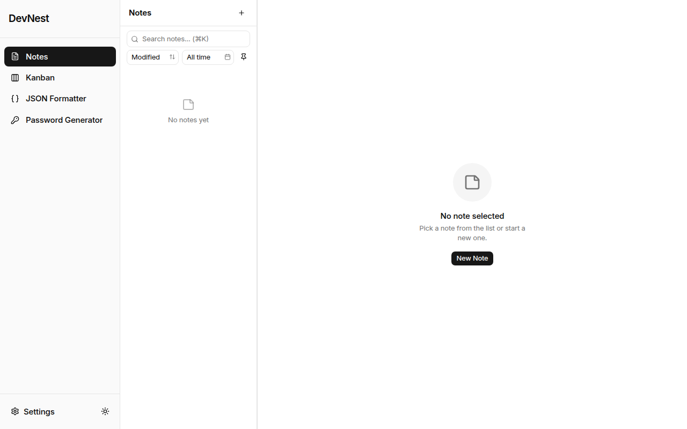
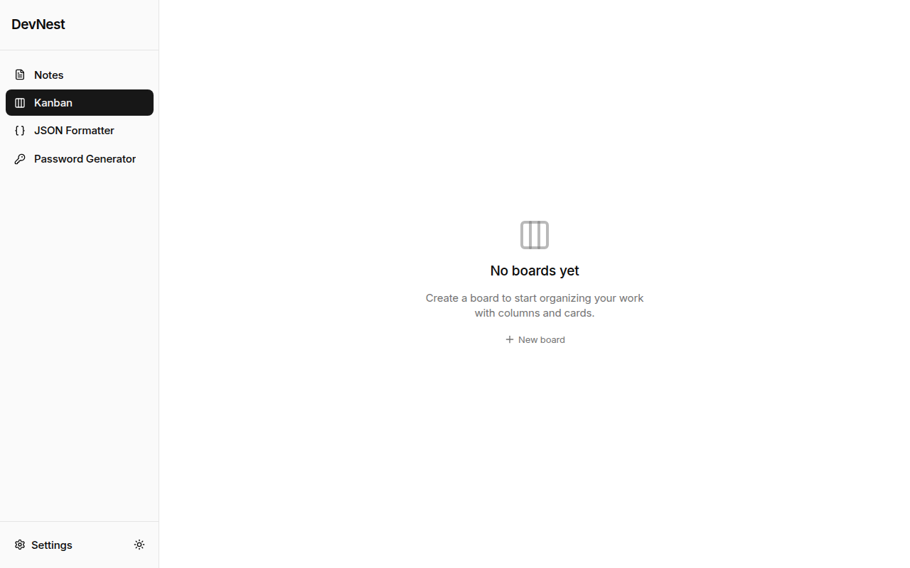
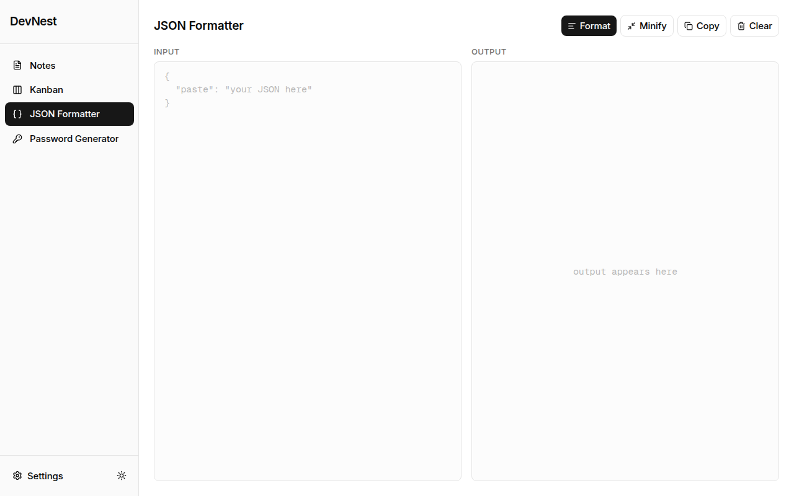
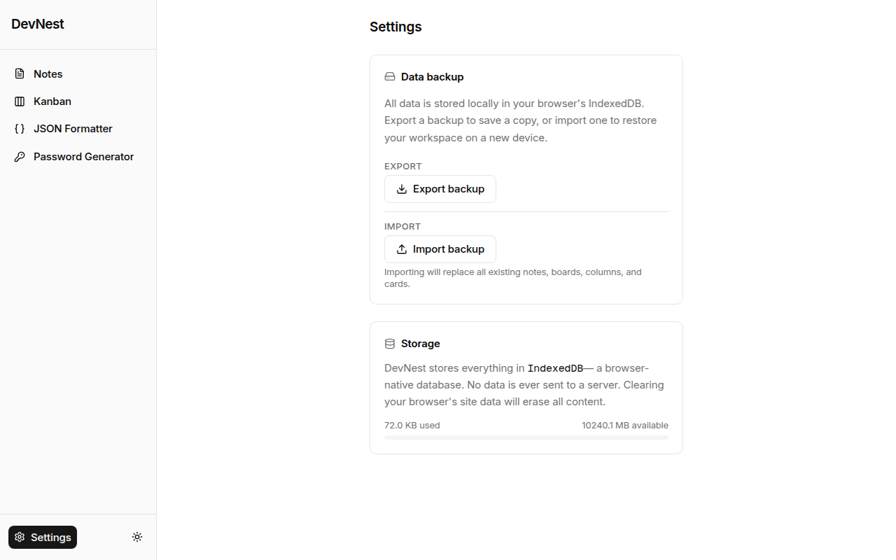
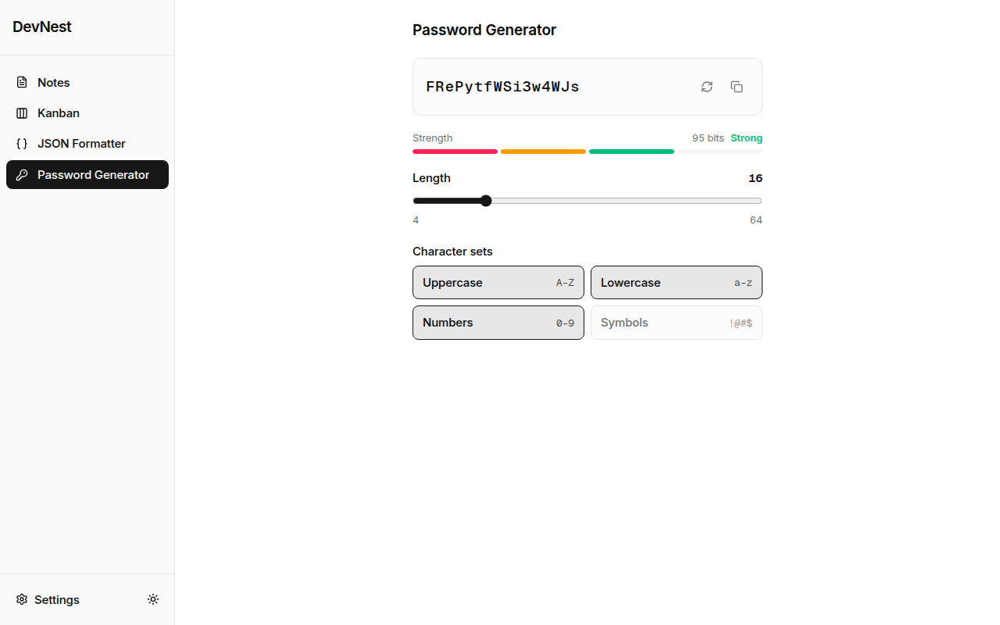

# DevNest

An offline-first personal developer workspace built with Next.js and Claude Code. Combines a WYSIWYG notes editor, Kanban board, password manager, and JSON explorer — all running entirely in your browser with no accounts or cloud required.

## Screenshots







## Features

### Notes
- Rich WYSIWYG editor powered by Tiptap (bold, italic, headings, lists, code blocks)
- Search notes by title or content
- Sort by date created, date updated, or title
- Pin important notes to the top
- Filter to show pinned notes only

### Kanban Board
- Multiple boards with drag-and-drop cards across columns
- Card detail panel — rich text description, priority levels, due dates, and labels
- Column color theming with 9 preset colors
- Card archiving — archive instead of delete, restore anytime
- Label management — create, assign, and remove color-coded labels
- Data backup and restore (JSON export/import)

### Other Tools
- **Password Manager** — store credentials locally, never leaves your browser
- **JSON Explorer** — paste, format, and explore JSON data

## Tech Stack

| Layer | Technology |
|---|---|
| Framework | Next.js 16 (App Router) |
| Language | TypeScript |
| Styling | Tailwind CSS v4 (CSS-first, no config file) |
| UI Components | shadcn/ui + @base-ui/react |
| Rich Text | Tiptap + ProseMirror |
| Animations | Motion v12 |
| Drag & Drop | @dnd-kit/core + @dnd-kit/sortable |
| Storage | IndexedDB via `idb` |
| Icons | lucide-react |
| Testing | Vitest + @testing-library/react |

## Getting Started

### Prerequisites

- Node.js 18+
- npm

### Installation

```bash
git clone https://github.com/David-Sang96/devnest.git
cd devnest
npm install
```

### Running the dev server

```bash
npm run dev
```

Open [http://localhost:3000](http://localhost:3000) in your browser. The app redirects to `/notes` on first load.

## Available Scripts

```bash
npm run dev        # Start development server (localhost:3000)
npm run build      # Production build
npm run lint       # Run ESLint
npx vitest         # Run test suite
npx vitest --ui    # Run tests with interactive UI
```

## Project Structure

```
src/
├── app/
│   ├── (workspace)/         # All workspace tools (shared sidebar layout)
│   │   ├── notes/           # Notes tool
│   │   ├── kanban/          # Kanban board tool
│   │   ├── password/        # Password manager
│   │   ├── json/            # JSON explorer
│   │   └── settings/        # App settings
│   ├── globals.css          # Tailwind v4 theme tokens (oklch color space)
│   └── layout.tsx
├── components/
│   ├── kanban/              # Kanban board components
│   ├── notes/               # Notes components
│   ├── layout/              # Sidebar, workspace shell
│   └── ui/                  # shadcn/ui base components
├── hooks/                   # Feature hooks (useNotes, useKanban, etc.)
├── lib/
│   ├── db.ts                # IndexedDB singleton via idb
│   └── backup.ts            # Export/import all data
└── types/                   # Shared TypeScript types

test/
├── components/              # Component tests
├── hooks/                   # Hook tests
└── lib/                     # Utility tests
```

## Data Storage

All data is stored locally in your browser using **IndexedDB** (database name: `developer-workspace`). Nothing is sent to any server.

Stores: `notes`, `kanban_boards`, `kanban_columns`, `kanban_cards`, `kanban_labels`

You can export all your data as a JSON backup from the Settings page and re-import it at any time.

## Built With Claude Code

This project was built entirely using [Claude Code](https://claude.ai/code) — Anthropic's CLI for AI-assisted development.

- Features designed using the **brainstorming** skill before any code was written
- Implemented with **subagent-driven development** — one Claude subagent per task with automated spec review after each
- Custom slash commands (`/commit`, `/push`, `/review`) for daily workflow
- Custom agent (`devnest-reviewer`) for project-aware code review
- 379 component and hook tests, all passing
